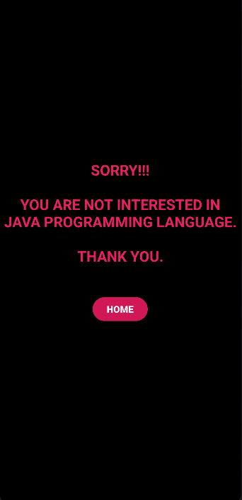
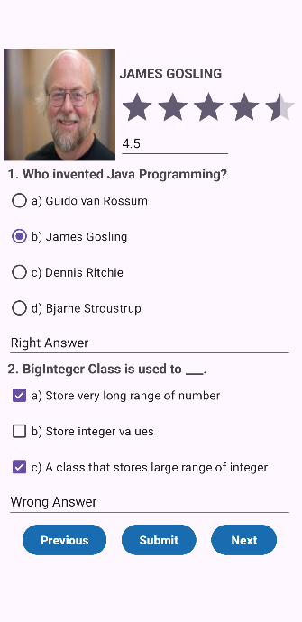
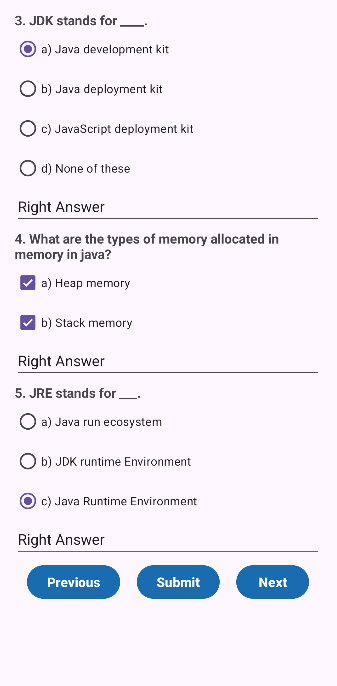
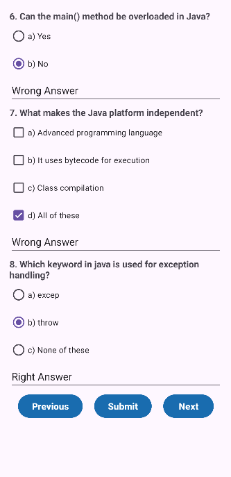
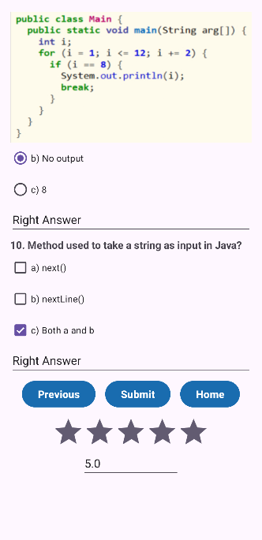

# 📘 ProfileMCQ – Android Quiz App

**Profile MCQ** is a lightweight Android quiz application that allows users to practice multiple-choice questions (MCQs) from various topics. It’s designed to help students and learners improve their skills through interactive quizzes.

## ✨ Features

- 📚 Multiple categories of MCQs
- ✅ Instant answer validation
- 📴 Fully offline functionality

## 📸 Screenshots

| HomePage Screen | NoPage Screen |
|-----------------|----------------|
|  |  |

| Page-01 Screen | Page-02 Screen |
|----------------|----------------|
|  |  |

| Page-03 Screen | Page-04 Screen |
|----------------|----------------|
|  |  |


## 🚀 Getting Started

### Requirements

- Android Studio Hedgehog or newer
- Gradle 8.8 or compatible version
- Android SDK 24+

### Installation

1. Clone the repository:
   ```bash
   git clone https://github.com/Saadmahmud-CSE/Profile_MCQ.git
2. Open the project in Android Studio.
3. Build and run on emulator or physical device.
